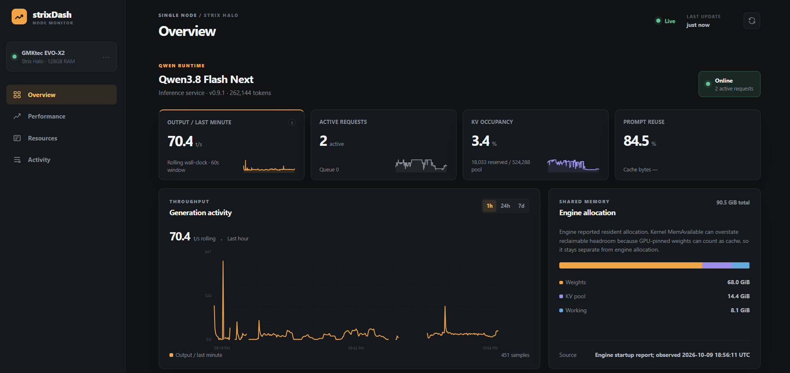

# strixDash

A lightweight, read-only dashboard for monitoring a single AMD Strix Halo system running Qwen through the Halogen inference server.

strixDash is optimized to work with **[halogen-flash-server](https://github.com/peonist-ai/halogen-flash-server)**. Halogen is a specialized inference server for Qwen3.8-Flash-Next on AMD Strix Halo (gfx1151), with GPU kernels tailored to this hardware and model family, speculative decoding, and an OpenAI-compatible API. strixDash uses its metrics and cache reporting to show model activity, throughput, and memory usage alongside host hardware counters.



## Features

- Model health, active requests, queue depth, and KV cache usage.
- Throughput history, prompt reuse, and speculative draft acceptance.
- AMD GPU utilization, temperature, clock speed, and reported power.
- CPU, shared memory, swap, storage capacity, and network monitoring.
- Sanitized operational events and source availability indicators.
- Responsive layout with dark and light themes.
- Local SQLite history with seven-day sample retention and 200 recent events.

## Architecture

The frontend uses vanilla JavaScript, CSS, and SVG with no build step or external runtime dependencies. The backend uses Python's standard library and SQLite, so no separate metrics database or monitoring stack is required.

A single background collector samples model counters approximately every two seconds while at least one dashboard browser is connected. Multiple tabs share the same collector. Each tab refreshes a short presence lease and sends a leave notification when navigating away; if that notification is lost, the lease expires after 20 seconds. Model polling pauses when the last tab leaves or expires, then resumes automatically when the dashboard opens again.

Hardware sampling and history writes also pause when no browser is connected. No model requests, hardware reads, or periodic database writes occur while monitoring is paused. Both model and hardware history have gaps during these periods, and rate calculations start fresh on reconnection so activity during the pause is not reported as a burst. Health checks and detailed cache queries run less frequently than counters. Collection timeouts can extend these intervals. History responses contain at most 600 aggregated points.

Monitoring is read-only. The dashboard does not submit inference requests or provide model administration controls. Prompts, completions, VPN credentials, and other secrets are excluded from collected data.

## Measurement notes

CPU and GPU share physical RAM. Engine-reported startup allocations are shown separately from operating-system counters because kernel available-memory figures can include GPU-pinned weights that cannot actually be reclaimed.

Output throughput is a rolling wall-clock rate derived from token counters. Counters may update when requests complete. Decode and prefill throughput show the last positive engine measurement with its age. Prompt reuse is the proportion of reported prompt tokens served from cache.

Detailed cache queries run only while inference is idle. Missing or expired measurements display a dash. GPU power is the driver's sensor reading rather than whole-system power consumption.

## Configuration and operation

View the available bind address, port, model endpoint, and data-directory options:

```sh
python server.py --help
```

Select values appropriate to your deployment. Review the collector's host-specific storage path and network-interface selection when adapting it to another system.

By default, the dashboard binds to loopback and reads the model endpoint on loopback port 8888. Set `--bind` and `--model-url` for your environment. Storage capacity is measured on the filesystem containing the dashboard code.

The dashboard has no built-in authentication or TLS. When enabling remote access, restrict it to trusted clients with a firewall or an authenticated reverse proxy. Do not expose it directly to the public Internet.

The included [systemd unit](strixdash.service) is a deployment template. Customize the service account, installation paths, environment, and resource limits before use. Restarting or stopping the dashboard does not restart the model server.

The template uses a `strixdash` service account, `/opt/strixdash` for code, and `/var/lib/strixdash` for data. Create the account and directories or adapt the template to your installation. Optional Podman log collection requires access to the account and runtime that own the model container.

## Validation

From the repository root:

```sh
python -m unittest discover -s . -p test_server.py -v
node --check web/app.js
```

The optional [browser check](check_browser.py) exercises desktop and mobile layouts, navigation, themes, and connection recovery using Playwright and an installed browser channel. Configure its target and browser channel for your environment.

Both browser checks accept `STRIXDASH_URL` for the dashboard address and `STRIXDASH_BROWSER_CHANNEL` for the installed Playwright browser channel (default: `msedge`).

Generated browser-test screenshots and runtime history are excluded from version control. The dashboard preview above is included as `dashboard.png`.

The optional [browser presence check](check_presence.py) verifies that two tabs share collection, the last tab leaving stops model requests, and reopening resumes polling. Like the layout check, configure its target and browser path for your environment.

## Acknowledgments

The interface is inspired by **[Mia's AI Lab's original sparkDash](https://github.com/MiaAI-Lab/sparkDash)**, especially its compact model cards, resource panels, and live monitoring layout.

strixDash is an independent implementation with original code and assets, focused on a single AMD Strix Halo node and Halogen model metrics.

## Contact

[craiu@noh.ro](mailto:craiu@noh.ro) / [@craiu on X](https://x.com/craiu)
